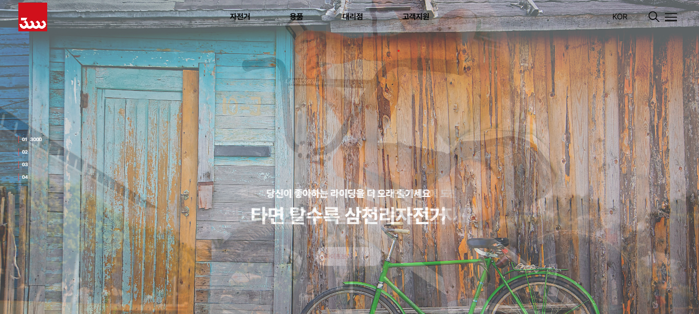
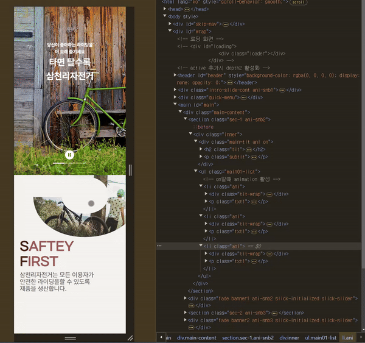
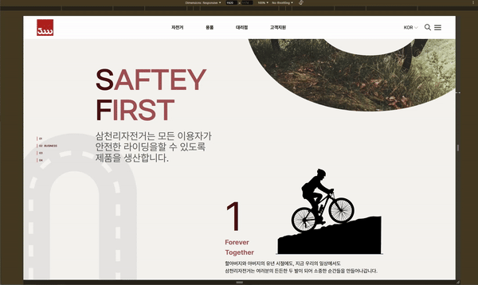
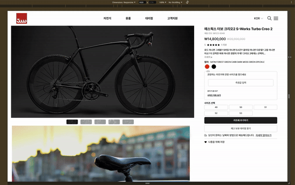

<!-- markdownlint-disable -->
<p align='center'>
    
</p>

## **📗 목차**

<b>

-   📝 [개요](#-포트폴리오-개요)
-   🛠 [기술 및 도구](#-기술-및-도구)
-   🔗 [링크](#-링크)
-   👨🏻‍💻 [기능 구현](#-기능-구현)
    -   [반응형 웹](#3-반응형-웹)
-   🚀 [배포](#-배포)
-   ⏰ [커밋 히스토리](#-커밋-히스토리)

</b>

## **📝 포트폴리오 개요**



> **프로젝트:** 기존 사이트 리메이크
>
> **기획 및 제작:** 권윤구
>
> **분류:** 개인 프로젝트
>
> **제작 기간:** 2024.10 ~ 11.
>
> **배포일:** 2024.11.24.
>
> **주요 기능:** 스크롤트리거 애니메이션, 반응형 웹, 배포 및 커스텀 도메인 연결
>
> **사용 기술:** html, css, javascript, 각종 라이브러리(swiper, slick, shoelace)
>
> **문의:** dbsrn1110@gmail.com

<br />

## **🛠 기술 및 도구**

   

<br />

## **🔗 링크**

**링크1-main(about):** [https://peaceryun.github.io/SCLBike/pages/](https://peaceryun.github.io/SCLBike/pages/)

**링크2-shopping:** [https://peaceryun.github.io/SCLBike/pages/shopping.html](https://peaceryun.github.io/SCLBike/pages/shopping.html)

**링크3-buying:** [https://peaceryun.github.io/SCLBike/pages/buying.html](https://peaceryun.github.io/SCLBike/pages/buying.html)

<br />

## **✨ 업데이트**

-   index페이지에 로딩페이지 추가(24.??.??)

<br />

## **👨🏻‍💻 기능 구현**

### **1. GSAP Scroll Trigger**



-   viewpoint의 50%를 기준으로 애니메이션이 트리거 되게 하였습니다.

```javascript
//ui-pattern-script.js
document.querySelectorAll('.ani').forEach(function (item) {
    ScrollTrigger.create({
        trigger: item,
        start: 'top 65%',
        end: '+=9999',
        once: true,
        toggleClass: {
            targets: item,
            className: 'on',
        },
        markers: false,
    });
});
```

### **2. scss 활용**

### **3. 반응형 웹**


<br/>
<br/>
<br/>

<br/>
<br/>
<br/>

<br/>
<br/>
<br/>
-   KRDS를 참고하여 3개의 endpoint를 두고 반응형을 구현하였습니다.
<br/>
<br/>


```scss
//_variables.scss
//breakpoints
$breakpoint-sm: 600px !default;
$breakpoint-md: 1024px !default;
$breakpoint-lg: 1920px !default;
$breakpoints: (
    'sm': $breakpoint-sm,
    'md': $breakpoint-md,
    'lg': $breakpoint-lg,
) !default;
```

```scss
// _breakpoints.scss
// 600px 이상일 경우
@mixin mobileMore {
    @media (min-width: $breakpoint-sm) {
        @content;
    }
}

//1024px 이상
@mixin tabletMore {
    //
    @media (min-width: $breakpoint-md) {
        @content;
    }
}
```

-   네비게이션 메뉴의 경우 tablet(1024px)을 기준으로 그 이상일 경우 gnb 메뉴 전체, 이하일 경우 검색과 햄버거메뉴만 보이게 하였습니다.

<br />

## ⏰ 커밋 히스토리

[내 커밋 히스토리 보러가기](https://github.com/peaceRyun/SCLBike/commits/main/)

<br/>
<br/>
<br/>

<!-- markdownlint-enable -->
