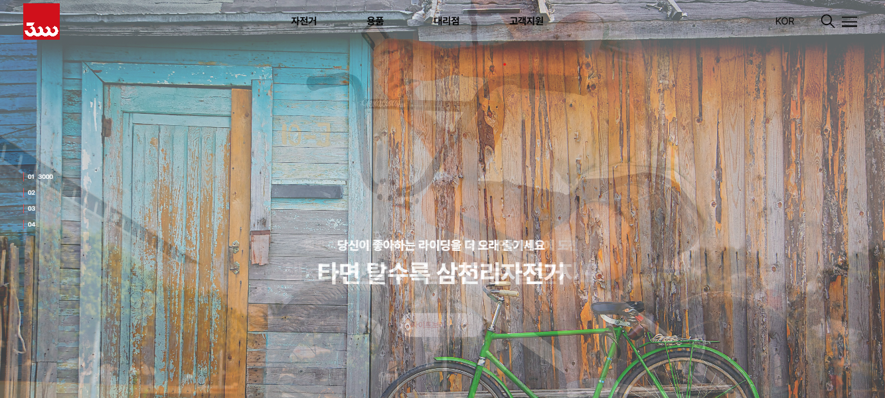
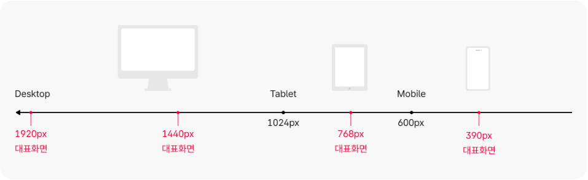
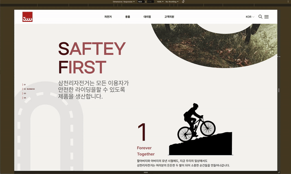
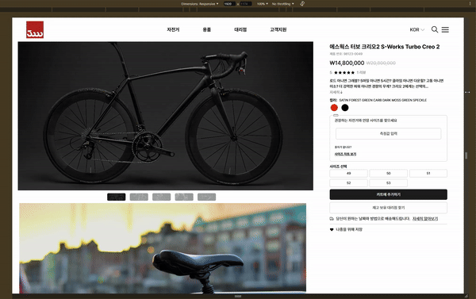

<!-- markdownlint-disable -->
<p align='center'>
    
</p>

## **📗 목차**

<b>

-   📝 [개요](#-포트폴리오-개요)
-   🛠 [기술 및 도구](#-기술-및-도구)
-   🔗 [링크](#-링크)
-   👨🏻‍💻 [기능 구현](#-기능-구현)
    -   [GSAP ScrollTigger](#1-GSAP-Scroll-Trigger)
    -   [scss](#2-scss-활용)
    -   [반응형 웹](#3-반응형-웹)
-   🚀 [배포](#-배포)
-   ⏰ [커밋 히스토리](#-커밋-히스토리)

</b>

## **📝 포트폴리오 개요**



> **프로젝트:** 기존 사이트 리메이크
>
> **기획 및 제작:** 권윤구
>
> **분류:** 개인 프로젝트
>
> **제작 기간:** 2024.10 ~ 11.
>
> **배포일:** 2024.11.24.
>
> **주요 기능:** 스크롤트리거 애니메이션, 반응형 웹, 배포 및 커스텀 도메인 연결
>
> **사용 기술:** html, css, javascript, 각종 라이브러리(swiper, slick, shoelace)
>
> **문의:** dbsrn1110@gmail.com

<br />

## **🛠 기술 및 도구**

   

<br />

## **🔗 링크**

**링크1-main(about):** [https://peaceryun.github.io/SCLBike/pages/](https://peaceryun.github.io/SCLBike/pages/)

**링크2-shopping:** [https://peaceryun.github.io/SCLBike/pages/shopping.html](https://peaceryun.github.io/SCLBike/pages/shopping.html)

**링크3-buying:** [https://peaceryun.github.io/SCLBike/pages/buying.html](https://peaceryun.github.io/SCLBike/pages/buying.html)

<br />

## **✨ 업데이트**

-   index페이지에 로딩페이지 추가(24.11.25)

<br />

## **👨🏻‍💻 기능 구현**

### **1. GSAP Scroll Trigger**


-   main 애니메이션 기준, viewpoint의 65%를 기준으로 애니메이션이 트리거 되게 하였습니다.

```javascript
//ui-pattern-script.js
document.querySelectorAll('.ani').forEach(function (item) {
    ScrollTrigger.create({
        trigger: item,
        start: 'top 65%',
        end: '+=9999',
        once: true,
        toggleClass: {
            targets: item,
            className: 'on',
        },
        markers: false,
    });
});
```

### **2. scss 활용**
```
│  .gitignore
│  README.md
│
├─pages
│  │  buying.html
│  │  example.html
│  │  index.html
│  │  shopping.html
│  │
│  └─layout
│          footer.html
│
└─resources
    ├─css
    │  │  pattern_css.css
    │  │
    │  └─output
    │          styles.css
    │          styles.css.map
    │          styles.min.css
    │          styles.min.css.map
    │
    ├─img
    │  ├─component
    │  │  └─common
    │  │          ico_arr_20_down_blue.svg
    │  │          ico_arr_accordion.svg
    │  │          ico_go_20.svg
    │  │
    │  ├─pattern
    │  │  │  shopping_art2_img_1.jpg
    │  │  │  shop_art3_img_1.jpg
    │  │  │
    │  │  ├─about
    │  │  │      banner1_bike_slide_1.jpg
    │  │  │      banner1_bike_slide_2.jpg
    │  │  │      banner1_bike_slide_3.jpg
    │  │  │      banner2_bike_slide_1.jpg
    │  │  │      banner2_bike_slide_2.jpg
    │  │  │      banner2_bike_slide_3.jpg
    │  │  │      bikepath1.svg
    │  │  │      bikepath2.svg
    │  │  │      bike_object1.png
    │  │  │      bike_object2.png
    │  │  │      bike_object3.png
    │  │  │      d_news_img_1.png
    │  │  │      intro_bike_slide_1.jpg
    │  │  │      intro_bike_slide_2.jpg
    │  │  │      intro_bike_slide_3.jpg
    │  │  │      m-news-img4.jpg
    │  │  │      mask1.jpg
    │  │  │      m_news_img_1.png
    │  │  │      m_news_img_2.png
    │  │  │      m_news_img_3.png
    │  │  │      pave-road.png
    │  │  │      pave-road2.png
    │  │  │      road.png
    │  │  │      road.svg
    │  │  │      road2.png
    │  │  │      sec1-bg-object1.jpg
    │  │  │      sec2-bg-object1.svg
    │  │  │      sec3-bg-object1.jpg
    │  │  │      t_news_img_1.png
    │  │  │      t_news_img_2.png
    │  │  │      t_news_img_3.png
    │  │  │
    │  │  ├─buying
    │  │  │      app_ruler.svg
    │  │  │      buy-main-img1.jpg
    │  │  │      buy-main-slide1.jpg
    │  │  │      buy-main-slide2.jpg
    │  │  │      buy-main-slide3.jpg
    │  │  │      buy-main-slide4.jpg
    │  │  │      buy-main-slide5.jpg
    │  │  │      buy-main-slide6.jpg
    │  │  │      buy-main-slide7.jpg
    │  │  │      buy-main1.jpg
    │  │  │      buy-main2.jpg
    │  │  │      buy-main3.jpg
    │  │  │      buy-main4.jpg
    │  │  │      buy-main5.jpg
    │  │  │      expand-more-icon.svg
    │  │  │      slide-spare1.jpg
    │  │  │      slide8.jpg
    │  │  │      slide9.jpg
    │  │  │
    │  │  ├─common
    │  │  │  │  3000logo2.svg
    │  │  │  │  3000로고.jfif
    │  │  │  │  arr_lnb.svg
    │  │  │  │  Bicycle loader animation.gif
    │  │  │  │  footer_award.png
    │  │  │  │  head-logo.png
    │  │  │  │  head_logo.svg
    │  │  │  │  ico-pause.svg
    │  │  │  │  ico-play.svg
    │  │  │  │
    │  │  │  └─readme
    │  │  │          buying.html-반응형.mp4
    │  │  │          buying.html.gif
    │  │  │          gsapST.gif
    │  │  │          index.html-반응형.mp4
    │  │  │          index.html.gif
    │  │  │          shopping.html-반응형.mp4
    │  │  │          shopping.html.gif
    │  │  │          반응형_krds.png
    │  │  │          썸네일_sclbike.png
    │  │  │          파일구조.png
    │  │  │          파일구조2.png
    │  │  │
    │  │  └─shopping
    │  │          helmet.png
    │  │          shop-bnr1.png
    │  │          shop-img1(mtn)-1.jpg
    │  │          shop-img1(mtn)-2.png
    │  │          shop-img1(mtn)-3.png
    │  │          shop-img1(mtn).jpg
    │  │          shop-img2(electric)-1.jpg
    │  │          shop-img2(electric).jpg
    │  │          shop-img2-1.jpg
    │  │          shop-img3(road)-1.jpg
    │  │          shop-img3(road).jpg
    │  │          shop-img3-1.jpg
    │  │          shop-img4(hybrid)-1.jpg
    │  │          shop-img4(hybrid).jpg
    │  │          shop-img4-1.jpg
    │  │          shop-img5(comfort-mtn)-1.jpg
    │  │          shop-img5(comfort-mtn).jpg
    │  │          shop-img5-1.jpg
    │  │          shop-img6(city)-1.jpg
    │  │          shop-img6(city).jpg
    │  │          shop-img6-1.jpg
    │  │          shop-img7(folding)-1.jpg
    │  │          shop-img7(folding).jpg
    │  │          shop-img8(junior)-1.jpg
    │  │          shop-img8(junior).jpg
    │  │          shop-img9(kids)-1.jpg
    │  │          shop-img9(kids).jpg
    │  │          shop_aside_slide_1.jpg
    │  │          shop_aside_slide_2.jpg
    │  │          shop_aside_slide_3.jpg
    │
    ├─js
    │  │  include.js
    │  │
    │  └─pattern
    │          ui-pattern-script(fail).js
    │          ui-pattern-script.js
    │          ui-slick-script.js
    │          ui-swiper-script.js
    │
    └─scss
        │  styles.scss
        │
        ├─component
        │  │  _font.scss
        │  │  _group_mixins.scss
        │  │  _include.scss
        │  │  _reset.scss
        │  │  _variables.scss
        │  │
        │  └─mixins
        │          _breakpoints.scss
        │          _utils.scss
        │
        └─pattern
                _p_about.scss
                _p_buying.scss
                _p_common.scss
                _p_content.scss
                _p_include.scss
                _p_layout.scss
                _p_shopping.scss
```
- 효율적인 css 디버깅을 하기 위하여 SCSS 전처리기를 사용했습니다.
- page와 resource 두 폴더로 나누어, page에는 html 파일들을 모아두고, resource에는 scss, js, 이미지 각각 폴더에 나누어 관리하였습니다. 
- font, reset설정, 변수, mixin(breakpoint, util-속기 커마)를 컴포넌트 단위로 각기 다른 scss파일로 정리한 후 include.scss에 모아 가독성과 재사용성을 높인 파일 구조를 만들기 위해 노력하였습니다.
- krds와 대기업의 웹사이트에서 개발자 옵션에 들어가 파일구조를 참고해보았습니다. pattern이라는 폴더를 만들어, 빠른 수정을 하기 위해 페이지별 style과 공통으로 반복되는 컴포넌트들을 파일별로 나누어 정리하였습니다.
### **3. 반응형 웹**

-   KRDS를 참고하여 3개의 대표화면(1920px, 768px, 390px)을 만들며 반응형을 구현하였습니다.

<br/>
<br/>

<br/>
<br/>

<br/>
<br/>
<br/>

<br/>
<br/>
<br/>

<br/>

```scss
//_variables.scss
//breakpoints
$breakpoint-sm: 600px !default;
$breakpoint-md: 1024px !default;
$breakpoint-lg: 1920px !default;
$breakpoints: (
    'sm': $breakpoint-sm,
    'md': $breakpoint-md,
    'lg': $breakpoint-lg,
) !default;
```

```scss
// _breakpoints.scss
// 600px 이상일 경우
@mixin mobileMore {
    @media (min-width: $breakpoint-sm) {
        @content;
    }
}

//1024px 이상
@mixin tabletMore {
    //
    @media (min-width: $breakpoint-md) {
        @content;
    }
}
```

-   네비게이션 메뉴의 경우 tablet(1024px)을 기준으로 그 이상일 경우 gnb 메뉴 전체, 이하일 경우 검색과 햄버거메뉴만 보이게 하였습니다.

<br />

## ⏰ 커밋 히스토리

[내 커밋 히스토리 보러가기](https://github.com/peaceRyun/SCLBike/commits/main/)

<br/>
<br/>
<br/>

<!-- markdownlint-enable -->
